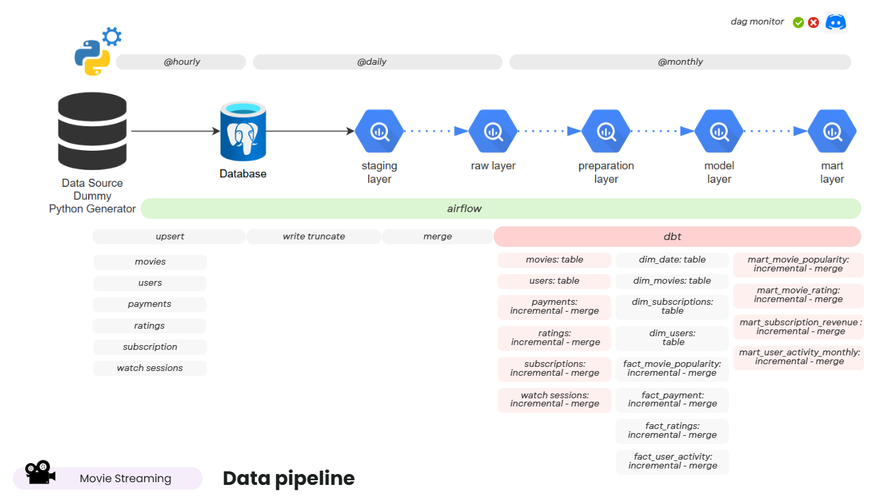
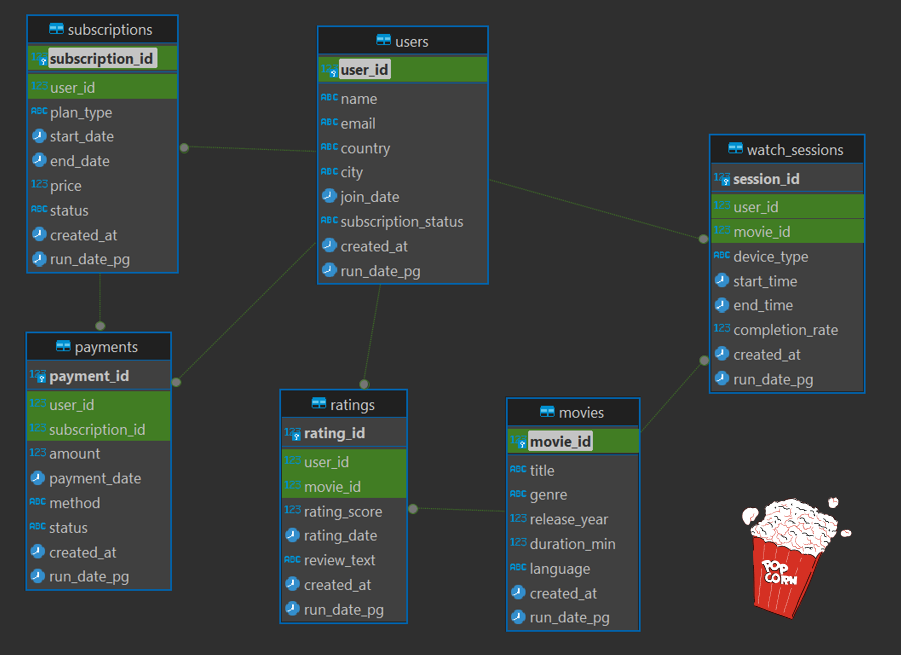

# 🎬 Movie Streaming Data Pipeline — Batch User Analytics
Airflow, dbt, PostgreSQL, and BigQuery

Proyek ini mensimulasikan sistem **Movie Streaming Platform** yang dirancang untuk **memahami perilaku pengguna** melalui analisis data historis (batch).  
Tujuannya adalah untuk:
- 🔁 **Mendeteksi potensi churn** dan membangun strategi **retargeting campaign** agar user tetap aktif  
- 💳 **Menganalisis pendapatan dan perilaku pembayaran** pelanggan  
- 📊 **Meningkatkan retensi** serta mengoptimalkan **rekomendasi konten, genre, atau film**  
- 🎥 **Membantu keputusan investasi produksi & lisensi konten** berdasarkan performa pengguna  


---

## 🎯 Tujuan Proyek

1. **Membangun pipeline batch end-to-end** untuk sistem movie streaming berbasis data simulasi
2. **Menganalisis aktivitas pengguna**, popularitas film, dan performa subscription
3. **Menyediakan mart analitik bulanan** untuk insight:
   - Churn rate & new users
   - Subscription revenue trend
   - Movie popularity & engagement
   - Average rating & satisfaction level

---

## 🧩 Dataset & Entities

### 🔹 Raw (Source) — dari data generator 


`movie_streaming_data_generator.py`
| Table | Deskripsi | Kolom |
|--------|------------|--------------|
| `raw_users` | Data pengguna & lokasi | `user_id`, `name`, `email`, `country`, `city`, `join_date`, `subscription_ststus` |
| `raw_movies` | Metadata film | `movie_id`, `title`, `genre`, `release_year`, `duration_min`, `language` |
| `raw_subscriptions` | Paket langganan | `subscription_id`, `plan_type`, `start_date`, `end_date`, `price`, `status` |
| `raw_payments` | Transaksi pembayaran | `payment_id`, `user_id`, `subscription_id`, `method`, `amount`, `status` |
| `raw_ratings` | Rating & review pengguna | `rating_id`, `user_id`, `movie_id`, `rating_score`, `rating_date`, `review_text` |
| `raw_watch_sessions` | Aktivitas menonton | `session_id`, `user_id`, `movie_id`, `device_type`, `start_time`, `end_time`, `completion_rate` |

### 🔹 Mart (Result) — hasil agregasi analitik (dbt)
| Model | Fokus Analitik | Contoh Insight |
|--------|----------------|----------------|
| `mart_movie_popularity_monthly` | Popularitas film | Film paling sering ditonton bulan ini |
| `mart_movie_rating_monthly` | Rating film bulanan | Rating rata-rata per genre |
| `mart_user_activity_monthly` | Aktivitas pengguna | Durasi tonton, sesi selesai |
| `mart_subscription_revenue_monthly` | Pendapatan & churn | Pendapatan langganan, pengguna churn |

---

## 🧱 Architecture Overview
```py
Data Generator (Python Faker)
↓   # hourly
Airflow → PostgreSQL (OLTP)
↓   # daily
Airflow → BigQuery (stg → raw)
↓   # monthly
dbt (preparation → model → mart)
```

| Lapisan | Deskripsi | Frekuensi |
|----------|------------|-----------|
| **Ingestion (PostgreSQL)** | Generator data simulasi → insert otomatis | **Hourly** |
| **ETL (Airflow → BigQuery)** | Load & sync raw data ke BigQuery | **Daily** |
| **Transformation (dbt)** | Jalankan model prep → dim/fact → mart | **Monthly** |

---

## 🧭 Airflow DAGs Overview

Semua pipeline batch dijalankan menggunakan **Apache Airflow** dengan struktur DAG berikut:

| DAG ID | Fungsi | Frekuensi | Layer |
|---------|---------|-----------|--------|
| **`dag_init_movie_streaming_data_to_postgres`** | Membuat schema dan tabel awal di PostgreSQL serta load data CSV awal (`users`, `movies`, `subscriptions`, dll) | Manual (sekali di awal) | Source Init |
| **`dag_init_movie_streaming_data_postgres_to_bigquery`** | Membuat dataset dan tabel awal di BigQuery (`raw` layer) berdasarkan schema Postgres | Manual (setup awal) | BQ Init |
| **`dag_init_dbt_movie_streaming_data`** | Menjalankan proses `dbt run` awal (full-refresh) untuk membuat semua model preparation, dimensi, dan mart | Manual (setup awal) | dbt Init |
| **`dag_ingest_movie_streaming_data_to_postgres_hourly`** | Menginsert data simulasi ke PostgreSQL menggunakan **Python Faker** untuk event pengguna baru, pembayaran, dan sesi nonton | **Hourly** | Ingestion |
| **`dag_ingest_movie_streaming_data_postgres_to_bigquery_daily`** | Mengekstrak data dari PostgreSQL → Load ke BigQuery `raw` table | **Daily** | ETL |
| **`dag_dbt_movie_streaming_data_monthly`** | Menjalankan **dbt incremental transformation** dari `preparation` → `model` → `mart` untuk analisis bulanan | **Monthly** | Transformation |

---

## ⚙️ Tech Stack

| Komponen | Tool | Fungsi |
|-----------|------|--------|
| **Scheduler / Orchestration** | Apache Airflow | Menjadwalkan proses ETL & dbt |
| **Database (OLTP)** | PostgreSQL | Sumber data transaksi pengguna |
| **Data Warehouse** | BigQuery | Penyimpanan & analisis data |
| **Transformation Framework** | dbt Core | Modelling & test data |
| **Containerization** | Docker Compose | Infrastruktur pipeline |
| **Monitoring** | Discord Webhook | Notifikasi status & error |
| **Data Simulation** | Python Faker | Generator data pengguna & film |

---

## 🔐 IAM & GCP Credentials

IAM Role Minimum (untuk Airflow DAG berjalan normal):
- BigQuery Data Editor
- BigQuery Job User
- Storage Object Admin (hanya untuk bucket GCS tujuan)
- Viewer (opsional, untuk debugging)

---

## Next Sections

> 📘 detail lengkap implementasi `dbt` → lihat:  
> [`movie_streaming_analytics_dbt.md`](./documentation/movie_streaming/movie_streaming_analytics_dbt.md)

menjelaskan detail teknis tiap layer dbt:
1. **Preparation Layer** – cleaning dan deduplikasi data raw  
2. **Model Layer** – star schema: `dim_` dan `fact_`  
3. **Mart Layer** – agregasi bulanan untuk analitik bisnis  
4. **Lineage Diagram** – alur dependensi antar model dbt  
---

## Key Highlights
- `Pipeline batch analitik end-to-end` dengan Airflow + dbt
- Analisis `churn`, `revenue`, `engagement`, dan `popularitas film`
- Terintegrasi dengan `PostgreSQL → BigQuery → dbt mart`
- Siap digunakan untuk dashboard

---

