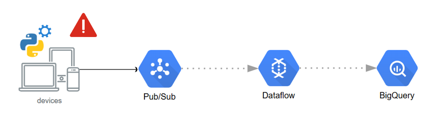

# 🎬 Movie Streaming — Real‑Time Video Playback Alerts
Pub/Sub, Dataflow, BigQuery

Proyek ini mensimulasikan sistem real-time analytics untuk mendeteksi **playback issues** (error & buffering) dari aktivitas pengguna ketika menonton video.
Pipeline memanfaatkan Google **Pub/Sub** sebagai event broker, **Dataflow** streaming job untuk memfilter alert, dan **BigQuery** sebagai storage untuk analisis performa playback per kota, ISP, dan film.



**Tujuan:**
- Mendeteksi `video playback failure` atau `high buffer duration (>4000 ms)` secara real-time.
- Menyimpan `data alert ke BigQuery` untuk dipantau lewat dashboard monitoring.

---

## 🧱 Arsitektur

```py
[publish_events (Python, Docker)]
       ⬇
Google Cloud Pub/Sub 
# (TOPIC: $PUB_MOVIE_STREAMING_VIDEO_PLAYBACK_TOPIC)
       ⬇  
Google Cloud Pub/Sub 
# (SUB: $SUB_VIDEO_PLAYBACK_BIGQUERY)
       ⬇  
Apache Beam (DataflowRunner) — filter alert (error | buffer>4000ms)
       ⬇
BigQuery (partition by run_date)
```

> **Alert rule**: `event_type == "error"` **atau** `buffer_duration_ms > 4000`.

---

## 📁 Struktur Proyek (ringkas)

```
├── dags/
│   └── dag_start_subscriber_alert_video_playback_events_bigquery.py
├── docker/
│   └── Dockerfile.publisher
├── helpers/
│   ├── bigquery_helper.py
│   └── pubsub_helper.py
├── scripts/
│   └── movie_streaming/
│       ├── publish_message_video_playback_events_movie_streaming.py
│       └── subscriber_alert_bigquery_video_playback_events.py
├── schemas/
│   └── bigquery_schemas/
│       └── pubsub_movie_streaming_schema.py (VIDEO_PLAYBACK_EVENT_SCHEMA)
└── docker-compose.yml
```

---

## 🔐 IAM Role yang Dibutuhkan (Service Account Dataflow)

Berikan pada service account yang dipakai pipeline & komponen lain:

| Resource      | Role                           |
| ------------- | ------------------------------ |
| IAM           | `roles/iam.serviceAccountUser` |
| Pub/Sub       | `roles/pubsub.editor`          |
| BigQuery      | `roles/bigquery.dataEditor`    |
| BigQuery      | `roles/bigquery.jobUser`       |
| Storage (GCS) | `roles/storage.admin`          |
| Dataflow      | `roles/dataflow.admin`         |
| Dataflow      | `roles/dataflow.worker`        |

---

## 🔧 Komponen Utama

### 1. Publisher (Event Generator)
File: `publish_message_video_playback_events_movie_streaming.py`
- Menghasilkan event acak dari 100 session aktif.
- Event mencakup: 
    - event_type → start, buffer, error, stop
    - buffer_duration_ms → waktu buffering acak (0–5000 ms)
    - city, isp, movie_id, user_id, dll.
- Publikasi batch setiap 10–60 detik ke Pub/Sub topic.

Contoh event yang diterbitkan:
```json
{
  "event_id": 123456,
  "session_id": 7,
  "user_id": 32,
  "movie_id": 15,
  "event_type": "buffer",
  "event_timestamp": "2025-10-27 21:10:55",
  "buffer_duration_ms": 4387,
  "bitrate_kbps": 2400,
  "city": "Bandung",
  "isp": "Indihome",
  "country": "Indonesia"
}
```
### 2. Subscriber/Pipeline
File: `subscriber_alert_bigquery_video_playback_events.py`
Menjalankan Apache Beam pipeline:
- Membaca pesan dari Pub/Sub subscription.
- Memfilter event dengan kondisi:
    - `event_type = "error"` atau
    - `buffer_duration_ms > 4000`.
- Menulis hasil filter ke BigQuery (table alert) menggunakan `WriteToBigQuery` streaming mode.

Dataflow Pipeline Parameters
| Parameter | Description |
| --------- | ----------- |
| `--runner=DataflowRunner` | Menjalankan di GCP Dataflow |
| `--streaming` | Streaming mode |
| `--temp_location` | Temp GCS folder |
| `--staging_location` | Staging GCS folder |
| `--service_account_email` | SA untuk akses Dataflow & BigQuery |

### 3. Airflow DAG
File: `dag_start_subscriber_alert_video_playback_events_bigquery.py`        
Orkestrasi dua task:
- Ensure Resources
    - Membuat dataset, tabel, dan subscription bila belum ada.
    - Menggunakan schema `VIDEO_PLAYBACK_EVENT_SCHEMA`.
- Run Dataflow Job
    - Menjalankan pipeline subscriber streaming dengan `BashOperator`.
DAG ini dijalankan manual (non-schedule) untuk memulai streaming job.

### 4. Pub/Sub Helper
File: `helpers/pubsub_helper.py`        

Menyediakan fungsi abstraksi untuk:
- Membuat topic dan subscription jika belum ada.
- Mengirim single atau batch message ke Pub/Sub.
- Menarik pesan untuk testing manual subscriber.

### 5. BigQuery Helper

File: `helpers/bigquery_helper.py`

Digunakan untuk membuat dataset, tabel, dan memuat schema JSON dengan otomatisasi partisi (run_date).

---

## 🧾 Skema BigQuery (ringkas)

Skema diambil dari `VIDEO_PLAYBACK_EVENT_SCHEMA` dan dibuat sebagai tabel partitioned `run_date`.

| Column | Type | Description |
| ------ | ---- | ----------- |
| event_id | INTEGER | Unique event |
| session_id | INTEGER | Session |
| user_id | INTEGER | User |
| movie_id | INTEGER | Movie |
| event_type | STRING | start / buffer / error / stop |
| event_timestamp | TIMESTAMP | Event time |
| buffer_duration_ms | INTEGER | Buffer time (ms) |
| bitrate_kbps | INTEGER | Bitrate |
| city | STRING | City |
| isp | STRING | Internet provider |
| country | STRING | Country |
| run_date | DATE | Partition column |

---

## ⚙️ Variabel Lingkungan (.env)

Contoh variabel yang dipakai:

```env
# Kredensial
GOOGLE_APPLICATION_CREDENTIALS=/app/secrets/bigquery-key.json
BQ_PROJECT_ID=your-gcp-project-id

# Pub/Sub
PUB_MOVIE_STREAMING_VIDEO_PLAYBACK_TOPIC=video-playback-events
SUB_VIDEO_PLAYBACK_BIGQUERY=video-playback-events-sub

# BigQuery
SUB_DATASET_ID=pubsub_src
SUB_TABLE_ID=video_playback_alerts

# GCS
GCS_BUCKET_NAME=your-bucket
```

---

## 🧰 Tech Stack
- Python
- Google Cloud Pub/Sub
- Apache Beam (Dataflow)
- Google BigQuery
- Airflow
- Docker Compose

---

## 🐳 Menjalankan Publisher (Docker)

```bash
# Build & run container publisher (profile: publisher)
docker compose --profile publisher up --build
```
Publisher container:
- Memastikan topic tersedia (create_topic)
- Mengirim batch event real-time setiap 10–60 detik

---

## 🚀 Menjalankan Pipeline via Airflow DAG

1. image & container Airflow:
   * folder `dags/` ke `/opt/airflow/dags/`
   * folder `scripts/` ke `/opt/scripts/`
   * file kredensial ke path `GOOGLE_APPLICATION_CREDENTIALS`.

2. Buka Airflow UI → **Trigger** DAG `dag_start_subscriber_alert_video_playback_events_bigquery`.
   * Task `ensure_resources` akan membuat dataset, tabel (partition `run_date`), dan subscription bila belum ada.
   * Task `run_dataflow_pipeline` menjalankan `python /opt/scripts/movie_streaming/subscriber_alert_bigquery_video_playback_events.py`.

---


