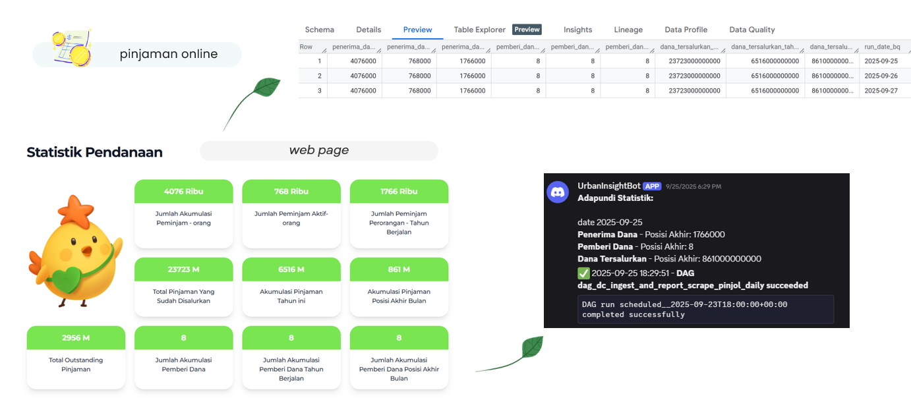

# 📊 Pinjol Daily Statistics Scraper & Reporter

Automated Web Scraping, BigQuery Ingestion, and Discord Reporting

Proyek **Pinjol Daily Statistics** ini bertujuan untuk mengambil **data statistik pinjaman online** (contoh Adapundi) secara **otomatis setiap hari**, menyimpannya ke **BigQuery**, dan mengirimkan laporan ringkas ke **Discord**.

Pipeline ini merupakan bagian dari sistem **data monitoring harian** yang membantu tim analis dalam memantau perubahan angka pinjaman, pendanaan, dan penerima dana dari platform resmi.

- Memantau perkembangan industri pinjol di Indonesia secara transparan.
- Mendeteksi tren pertumbuhan jumlah pemberi dan penerima dana.



---

## Structure
```
pinjol
├── dags
│   └── dag_ingest_and_report_scrape_pinjol_daily.py
│
├── helpers
│   ├── bigquery_helper.py
│   └── discord_helper.py
│
├── scripts
│   └── pinjol
│       └── crawl_pinjol_statistics.py
│
├── secrets
│   └── bigquery-key.json
│
├── .env
├── docker-compose.yml
└── requirements.txt
```
---

## Tech Stack
| Layer | Tools/Tech |
| ----- | ---------- |
| Orchestration | Apache Airflow |
| Scraping | Selenium + BeautifulSoup |
| Data Warehouse | BigQuery |
| Notification | Discord Webhook |
| Alerting | Discord Webhook |
| Containerization | Docker Compose |
| Helper Modules | Python (BigQuery Helper, Discord Helper) |
---

## Pipeline Architecture
Alur Data
```
Selenium (Scraping HTML Page)
        ↓
    Pandas DataFrame
        ↓
BigQuery (Dataset: pinjol_source)
        ↓
Discord (Ringkasan Statistik Harian)
```
---
DAG Airflow
```
ensure_dataset_and_table
        ↓
scrape_adapundi
        ↓
ingest_to_bigquery
        ↓
report_to_discord
```

---
## Dataset
Kolom yang Disimpan
| Kolom | Deskripsi | Tipe |
| ----- | --------- | ---- |
| `penerima_dana_total` | Total penerima dana | INTEGER |
| `penerima_dana_tahun_berjalan` | Jumlah penerima tahun berjalan | INTEGER |
| `penerima_dana_posisi_akhir` | Jumlah penerima terkini | INTEGER |
| `pemberi_dana_total` | Total pemberi dana | INTEGER |
| `pemberi_dana_tahun_berjalan` | Jumlah pemberi tahun berjalan | INTEGER |
| `pemberi_dana_posisi_akhir` | Jumlah pemberi terkini | INTEGER |
| `dana_tersalurkan_total` | Total dana tersalurkan | INTEGER |
| `dana_tersalurkan_tahun_berjalan` | Dana tersalurkan tahun berjalan | INTEGER |
| `dana_tersalurkan_posisi_akhir` | Dana tersalurkan terkini | INTEGER |
| `run_date_bq` | Tanggal eksekusi scraping | DATE
---

## Komponen
#### 1️⃣ DAG: dag_ingest_and_report_scrape_pinjol_daily.py
- Menjalankan seluruh pipeline setiap hari pukul 23:00 WIB.
- Tugas utama:
    - `ensure_dataset_and_table` → membuat dataset & tabel di BigQuery jika belum ada.
    - `scrape_adapundi` → melakukan scraping data statistik Adapundi dengan Selenium + BeautifulSoup.
    - `ingest_to_bigquery` → memasukkan hasil scraping ke BigQuery, dengan kolom partisi run_date_bq.
    - `report_to_discord` → mengirimkan ringkasan statistik ke Discord.

#### 2️⃣ Script Scraping: crawl_pinjol_statistics.py
- Menggunakan Selenium Remote WebDriver (Docker) untuk menavigasi halaman dan mengambil data numerik.
- Normalisasi satuan dilakukan dengan mapping:      
`“ribu”`, `“jt”`, `“m”`, `“t”` → dikonversi otomatis ke angka penuh.
- Output disusun sebagai DataFrame berisi 1 baris statistik harian.

#### 3️⃣ BigQuery Helper (helpers/bigquery_helper.py)
- Mengelola dataset dan tabel dengan wrapper class BigQueryProject.
- Operasi:
    - create_dataset_if_not_exists
    - insert_df
    - delete_where
    - ensure_schema

#### 4️⃣ Discord Helper (helpers/discord_helper.py)
- Mengirim pesan notifikasi sukses/gagal serta laporan statistik harian ke channel Discord.

---
## Selenium Container
```yml
selenium:
  image: seleniarm/standalone-chromium:latest
  shm_size: 2g
  ports:
    - 4444:4444
  environment:
    SE_NODE_SESSION_TIMEOUT: 600
    SE_NODE_MAX_SESSIONS: 1
  healthcheck:
    test: ["CMD", "curl", "-f", "http://127.0.0.1:4444/wd/hub/status"]
```
---

## Environment Variables (.env)
```
BQ_PROJECT_ID=your_project
GOOGLE_APPLICATION_CREDENTIALS=/opt/secrets/bigquery-key.json
DISCORD_WEBHOOK_URL=https://discord.com/api/webhooks/xxxx
```

## Usage Instructions
1. Set environment
2. Run Docker Compose
    ```
    docker-compose up -d
    ```
3. Akses Airflow UI
    ```
    http://localhost:8080
    ```
4. Run DAG
Turn ON `dag_ingest_to_bq_and_report_to_dc_scrape_pinjol_daily`     
DAG otomatis jalan setiap pukul 23:00 WIB

---
## 📬 Alerts & Monitoring

Setiap kegagalan atau keberhasilan DAG dikirim otomatis ke **Discord Webhook** :
- Nama DAG & task yang gagal
- Error message
- Waktu eksekusi

---
## Key Highlights
✅ `End-to-end automation` dari scraping → ingestion → reporting.   
✅ `Real-time notification` jika gagal/sukses.            
✅ `Extendable` untuk menambah situs pinjol lain dengan pola serupa.          