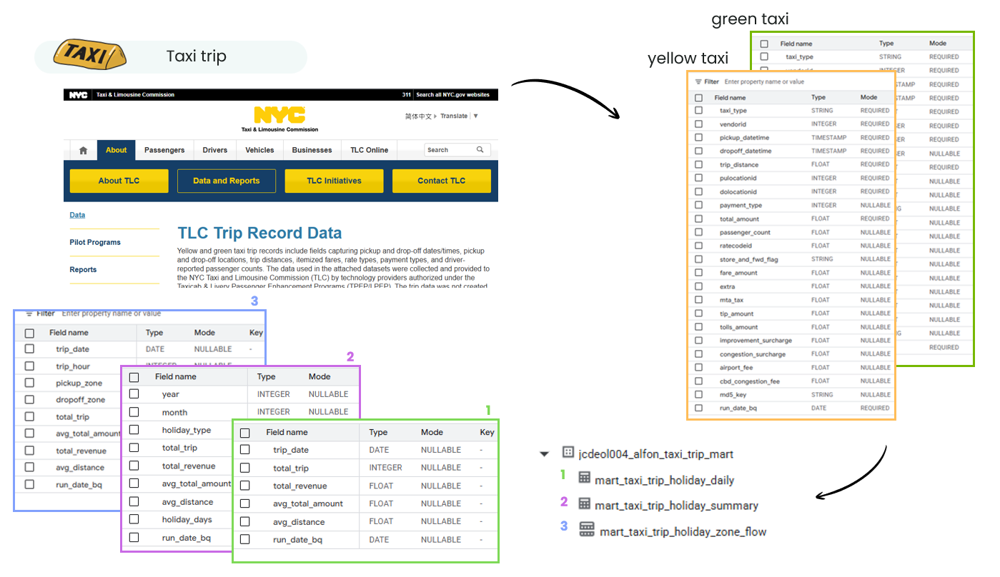
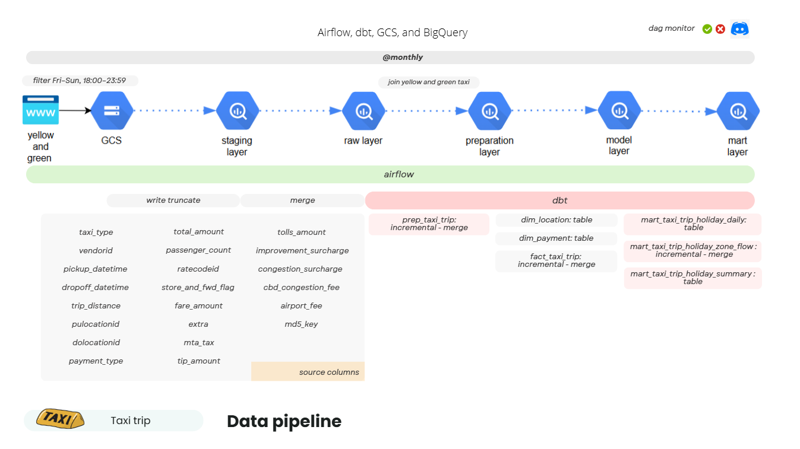

# 🚕 Weekend Night Trips — NYC Taxi Mobility Analysis
Airflow, dbt, GCS, and BigQuery

Proyek ini dikembangkan untuk sebuah perusahaan konsultan yang membutuhkan data mobilitas penduduk faktual pada akhir pekan dan hari libur, dengan tujuan:
- Memberikan **insight pergerakan warga New York City (NYC)** di malam hari selama akhir pekan.
- Menjadi **data pendukung (auxiliary dataset)** yang dapat dipadukan dengan data internal klien, seperti aktivitas retail, transportasi umum, event, atau ekonomi daerah.

Dataset utama berasal dari NYC Taxi & Limousine Commission (TLC) yang menyediakan data trip harian dalam format Parquet.



Pipeline dibangun untuk mengambil data dari **URL publik**, memproses **filtering weekend-night trips**, dan menyimpannya ke **Google Cloud Storage (GCS)** dan **BigQuery** secara **incremental bulanan**, lalu dimodelkan menggunakan **dbt** hingga **mart layer** untuk analisis dan dashboard.

---

## Tech Stack
| Layer | Tools/Tech |
| ----- | ---------- |
| Orchestration | Apache Airflow |
| Data Storage | Google Cloud Storage (GCS) |
| Data Warehouse | BigQuery |
| Transformation | dbt (Data Build Tool) |
| Alerting | Discord Webhook |
| Containerization | Docker Compose |
| Helper Modules | Python (BigQuery Helper, GCS Helper, Discord Helper, etc.) |

---

## Repo Structure
```py
taxi_trip
├── dags
|   |   # Monthly data ingestion (NYC → GCS → BQ)
│   ├── dag_ingest_taxi_trip_to_gcs_bq_monthly.py  
|   |   
|   |   # Monthly dbt run (preparation → model → mart)
│   ├── dag_dbt_taxi_trip_bq_monthly.py    
|   |   
|   |   # One-time full-refresh initialization         
│   ├── dag_init_dbt_taxi_trip_bq_monthly.py
|   |   
|   |   # Ingest taxi zone reference table         
│   └── dag_ingest_taxi_zone.py                     
│
├── dbt
│   └── dbt_alfon_project
│       └── models/taxi_trip
|           |   # Combine + clean yellow & green taxi
│           ├── preparation/prep_taxi_trip.sql      
|           |
|           |   # Unified fact table with zones & payment type
│           ├── model/fact_taxi_trip.sql         
|           |
|           |   # Dim tables: location, holiday, payment type   
│           ├── model/dim_*.sql       
|           |
|           |   # Aggregated marts for analysis                 
│           └── mart/                               
│               ├── mart_taxi_trip_holiday_zone_flow.sql
│               ├── mart_taxi_trip_holiday_daily.sql
│               └── mart_taxi_trip_holiday_summary.sql
│
├── helpers/    # Shared helper utilities
│   ├── bigquery_helper.py
│   ├── gcs_helper.py
│   ├── discord_helper.py
│   └── dataframe_helper.py
│
│   # Fetch, filter (Fri–Sun night), clean data
├── scripts/taxi_trip/script_ingest_taxi_trip.py  
|
|   # Schema definitions for Yellow/Green Taxi  
├── schemas/bigquery_schemas/taxi_trip_schemas.py 
|
|   # Airflow, PostgreSQL, and dbt containers  
├── docker-compose.yml                          
├── .env                                            
└── requirements.txt                                
```
---

## Pipeline Architecture
```mathematica
Source (NYC TLC Parquet URL)
        │
        ▼
[Airflow DAG] 
  dag_ingest_taxi_trip_to_gcs_bq_monthly.py
        │
        ├── fetch & filter weekend-night trips (Fri–Sun, 18:00–23:59)
        ├── store parquet to GCS
        ├── load to BigQuery (stg)
        └── merge into raw tables
        │
        ▼
[dbt pipeline]
  ├── preparation layer  → combine yellow/green, clean, deduplicate
  ├── model layer        → fact & dimension tables
  └── mart layer         → daily & monthly mobility metrics
        │
        ▼
BigQuery (gold/mart)
        │
        ▼
Dashboard / Analytical Tools

```
---

## Data Pipeline Flow



### 1️⃣ Ingestion Layer (Airflow → GCS & BigQuery)
File utama:         
`dag_ingest_taxi_trip_to_gcs_bq_monthly.py`

File pendukung:     
`script_ingest_taxi_trip.py` → fungsi fetch & filter.       
`taxi_trip_schemas.py` → definisi schema BigQuery.      

#### Extraction — Monthly NYC TLC Data
- Sumber data diambil langsung dari NYC TLC Parquet API:
    ```
    https://d37ci6vzurychx.cloudfront.net/trip-data/{taxi_type}_tripdata_{year}-{month}.parquet
    ```
- Data difilter menggunakan **PyArrow** untuk hanya menyertakan perjalanan dengan:
    - **Pickup day**: Jumat–Minggu (day 4–6)
    - **Pickup time**: ≥18:00
    - **Dropoff time**: ≤23:59

#### Load — GCS → BigQuery
- Hasil filter disimpan di **Google Cloud Storage (GCS)** dengan struktur:
    ```
    alfon_taxi_trip/stagging/{taxi_type}/{year}/{year}_{month}_{taxi_type}_taxi.parquet
    ```
- Selanjutnya di-load ke BigQuery **staging** table (stg), lalu **di-merge** ke **raw** table secara incremental.
- Schema tabel:
    - `stg_yellow_taxi_trip`, `stg_green_taxi_trip`
    - `raw_yellow_taxi_trip`, `raw_green_taxi_trip`

### 2️⃣ Transformation & Modeling (dbt)
File utama:     
`dag_dbt_taxi_trip_bq_monthly.py` → menjalankan pipeline bulanan.
`dag_init_dbt_taxi_trip_bq_monthly.py` → full-refresh init run.

#### Preparation Layer
`prep_taxi_trip.sql`        
Menggabungkan dan membersihkan raw data **yellow dan green taxi**, menghapus duplikat menggunakan `md5_key`.

#### Model Layer
`fact_taxi_trip.sql`    
Membangun data warehouse fact & dimension.    
Menghubungkan `prep_taxi_trip` dengan dimensi berikut:
- `dim_location` → Lokasi pickup/dropoff
- `dim_payment_type` → Jenis pembayaran
- `dim_holiday` → Hari libur/weekend per jam

#### Mart Layer
Analitik mobilitas akhir pekan (harian, bulanan, zona):
| Model | Deskripsi |
| ----- | --------- |
| `mart_taxi_trip_holiday_zone_flow` | Flow pickup–dropoff antar zona, per jam. |
| `mart_taxi_trip_holiday_daily` | Agregasi harian total trip, revenue, dan jarak. |
| `mart_taxi_trip_holiday_summary` | Rangkuman bulanan berdasarkan jenis hari (Jumat/Sabtu/Minggu). |

---

## Usage Instructions
### 1. Setup Environment
```
BQ_PROJECT_ID=<your_project_id>
GOOGLE_APPLICATION_CREDENTIALS=/opt/secrets/bigquery-key.json
GCS_BUCKET_NAME=<your_gcs_bucket>
DBT_PROJECT_PATH=/opt/airflow/dbt/dbt_alfon_project
DBT_PROFILES_PATH=/opt/airflow/dbt/dbt_profiles
```

### 2. Run with Docker Compose
```
docker-compose up -d
```

### 3. Open Airflow UI
```
http://localhost:8080
```

### 4. Run Initial DAG (One-time)
- `dag_ingest_taxi_zone` → inisialisasi zona lokasi.
- `dag_init_dbt_taxi_trip_bq_monthly` → jalankan full-refresh dbt pertama kali.

### 5. Run Monthly Workflow
- `dag_ingest_taxi_trip_to_gcs_bq_monthly`
→ download dan ingest data (catchup dari 2023-01).
- `dag_dbt_taxi_trip_bq_monthly`
→ jalankan transformasi incremental dbt.

---
## 📬 Alerts & Monitoring

Setiap kegagalan atau keberhasilan DAG dikirim otomatis ke **Discord Webhook** :
- Nama DAG & task yang gagal
- Error message
- Waktu eksekusi

---

## Key Highlights
✅ Incremental monthly ETL with backfill (Jan 2023 → now)       
✅ Weekend-night filter logic (Fri–Sun, 18:00–23:59)        
✅ dbt layered modeling (prep → model → mart)       
✅ Modular Python helper classes for GCS & BigQuery     
✅ Automatic Discord alerting       
